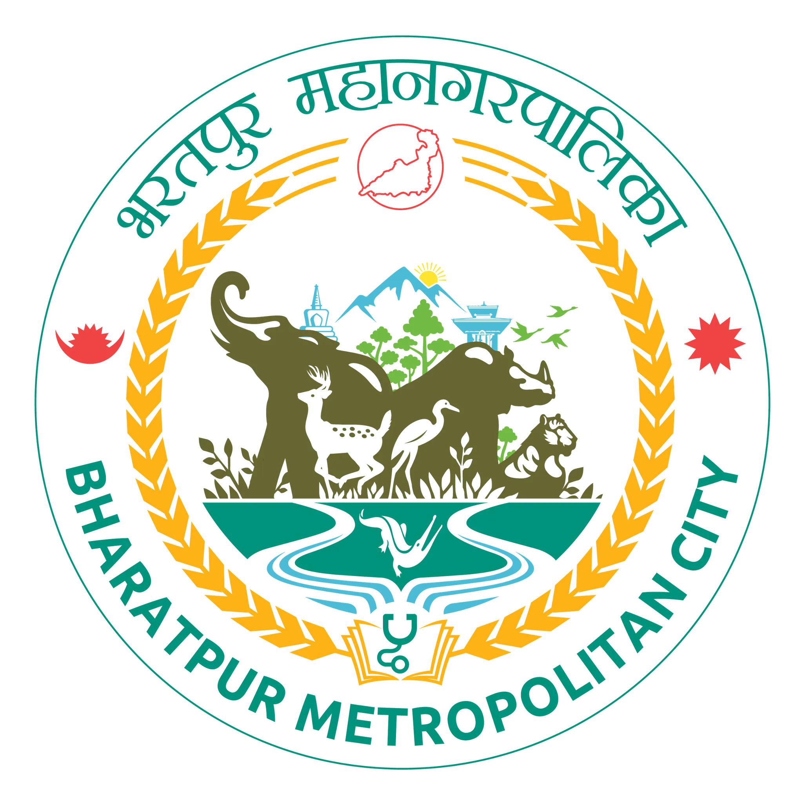
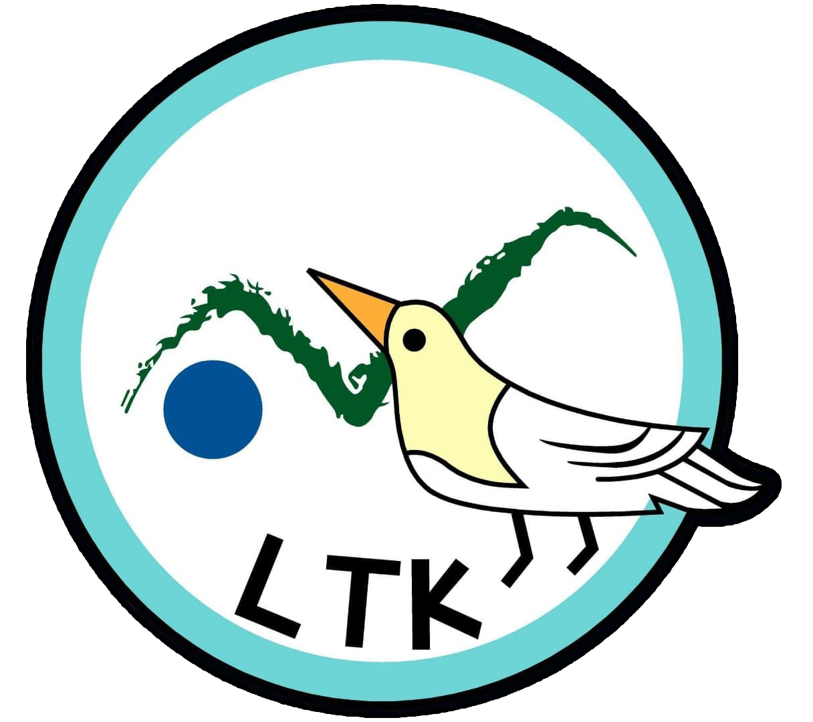
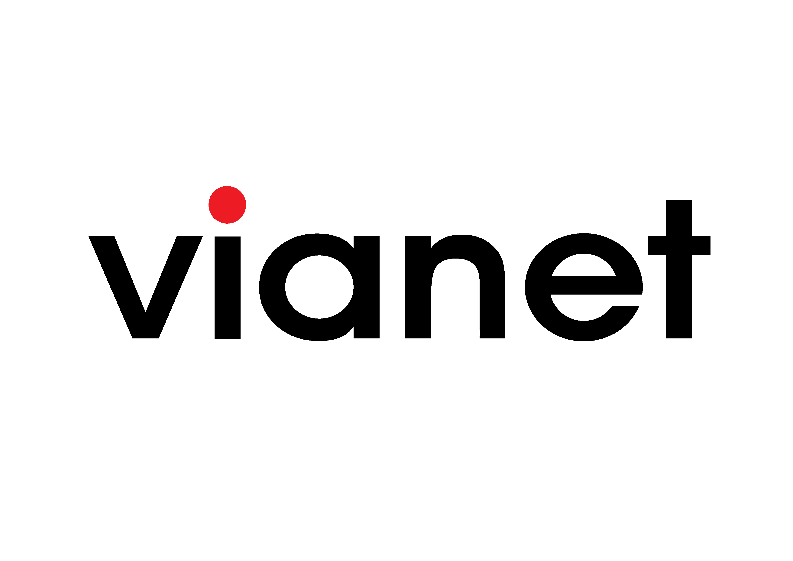
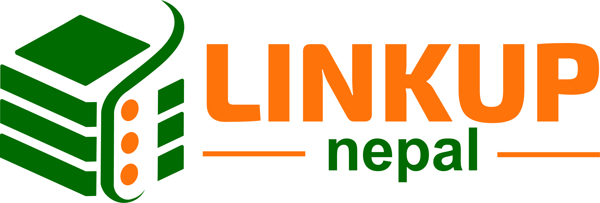
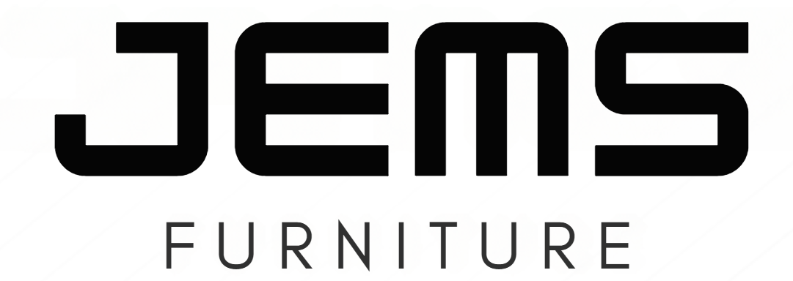

# BIC Hackathon V 4.0 -Hack The City

  
Welcome to the **BIC Hackathon V 4.0** GitHub organization! This repository will serve as the central hub for all hackathon-related code, resources, and progress.

---

## Event Details

**Event Name:** BIC Hackathon V 4.0  
**Theme:** Hack the City  
**Dates:** December 18–20, 2024  
**Location:** Bharatpur-10, Chitwan, Nepal  
**Website:** [hackathon.bic.edu.np](https://hackathon.bic.edu.np/)  
**Contact Email:** [adhikaribikash582@gmail.com](mailto:adhikaribikash582@gmail.com)

### Total Participating Teams

- **17 Teams** from various provinces of Nepal.

### Prize Pool

- **Total Prize Pool:**
  - **NPR 80,000** in cash
  - **NPR 600,000** in gifts and vouchers

### Prize Breakdown

- **Winner Team:**

  - **Cash Prize:** NPR 50,000
  - **One-Year Premium Hosting** from **LinkNepal**
  - **Redeemable Voucher** from **Ghumti Pasal**

- **Most Innovative Project:**

  - **Cash Prize:** NPR 20,000
  - **One-Year Premium Hosting** from **LinkNepal**
  - **Redeemable Voucher** from **Ghumti Pasal**

- **Best Use of Technology:**

  - **Cash Prize:** NPR 10,000
  - **One-Year Premium Hosting** from **LinkNepal**
  - **Redeemable Voucher** from **Ghumti Pasal**

- **All Participants:**
  - **One-Year Premium Programming Pro Subscription From Programiz**
  - Many More-

---

## Hackathon Theme: Hack the City

**Hack the City** focuses on leveraging technology to revolutionize urban living and address the challenges faced by modern cities. As urban areas grow and evolve, there is an increasing need for innovative solutions that enhance transportation, infrastructure, public services, and overall quality of life. Hack the City invites participants to develop groundbreaking tech-driven solutions that will help shape the future of urban environments.

### Why This Theme?

Urban areas are rapidly expanding, bringing with them complex challenges that require smart solutions. The Hack the City theme encourages participants to harness technology to tackle these challenges head-on, whether through improving efficiency, sustainability, or inclusivity in city living. This theme is designed to inspire creative problem-solving and technological innovation, making cities smarter, safer, and more responsive to the needs of their residents. It aligns with global trends in smart city development and provides a platform for participants to demonstrate their skills and creativity in addressing real-world issues.

### Sub-Themes for Participants:

Participants can explore several sub-themes under Hack the City, including but not limited to:

- **Smart Mobility & Transportation:** Solutions to enhance public transit systems, streamline traffic management, or create new mobility platforms.

- **Sustainable Energy and Waste Management:** Technologies to promote green practices through smart energy grids, renewable energy solutions, and efficient waste management systems.

- **Public Safety and Security:** Development of smart surveillance systems, emergency response tools, or disaster preparedness technologies.

- **Digital Governance and Public Services:** Platforms for streamlining government services, making processes more efficient and accessible through digital tools.

- **Urban Infrastructure and Smart Buildings:** Design of smart infrastructure and buildings equipped with IoT sensors for improved energy efficiency, maintenance, and security.

- **Citizen Engagement and Urban Inclusivity:** Technologies that empower citizens to engage in governance, report issues, or provide feedback on public services.

- **Sustainable Water and Resource Management:** Smart water management systems, resource optimization tools, or technologies to minimize waste in urban settings.

### Impact of the Hack the City Hackathon

The Hack the City hackathon is a powerful opportunity to drive meaningful change in urban environments. By addressing critical urban challenges with innovative tech solutions, participants have the pote

## Our Sponsors

We extend our heartfelt gratitude to our sponsors for their generous support and contributions to **BIC Hackathon V 4.0**:

---

### **Brought to You By**

- **Boston International College**  
  _(Empowering innovation and learning for a brighter future.)_  
  

---

### **In Collaboration With**

- **Bharatpur Metropolitan City**  
  _(Supporting local innovation and technological advancement.)_  
  

---

### **E-Learning Partner**

- **Programiz**  
  _(Your ultimate platform for coding tutorials and practice.)_  
  

---

### **Co-Title Sponsor**

- **Lake Twenty Thousand Farm & Retreat**  
  _(Experience serenity and sustainability at our eco-friendly retreat.)_  
  

---

### **ISP Partner**

- **Vianet**  
  _(Nepal’s leading internet service provider for seamless connectivity.)_  
  

---

### **Hosting Partner**

- **LinkUp Nepal**  
  _(Providing world-class web hosting solutions.)_  
  

---

### **Silver Sponsor**

- **Serene Boutique**  
  _(Luxury fashion and accessories to elevate your style.)_  
  

---

### **Styling Partner**

- **B&W Fashion**  
  _(Modern and trendy clothing for every occasion.)_  
  

---

### **Banking Partner**

- **Siddhartha Bank**  
  _(Empowering financial solutions for a prosperous future.)_  
  

---

### **Furnishing Partner**

- **Jems Furniture**  
  _(Stylish and affordable furniture for every home.)_  
  

---

### **Robotic Partner**

- **Ghumti Pasal**  
  _(Revolutionizing robotics with cutting-edge products.)_  
  

---

### **Lifestyle Partner**

- **CG Landmark**  
  _(Premium lifestyle and shopping destination.)_  
  

---

### **Community Partners**

- **AI/ML API**  
  _(Fostering AI/ML innovation for a tech-savvy future.)_  
  

- **Birendra Open Source Club (BOSC)**  
  _(Promoting open-source contributions and collaboration.)_  
  

---
